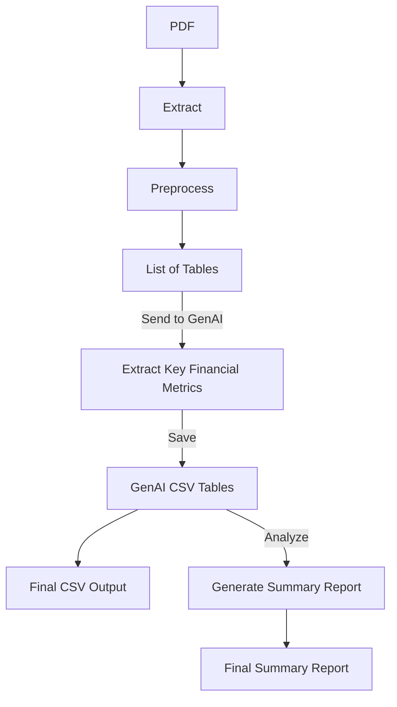

#### General Pipeline Structure

```mermaid
graph TD
    A[PDF] --> B[Extract]
    B --> C[Preprocess]
    C --> D[List of Tables]
    D -->|Send to GenAI| E[Extract Key Financial Metrics]
    
    E -->|Save| F[GenAI CSV Tables]
    F --> H[Final CSV Output]
    F -->|Analyze| G[Generate Summary Report]
    
    G --> I[Final Summary Report]
```