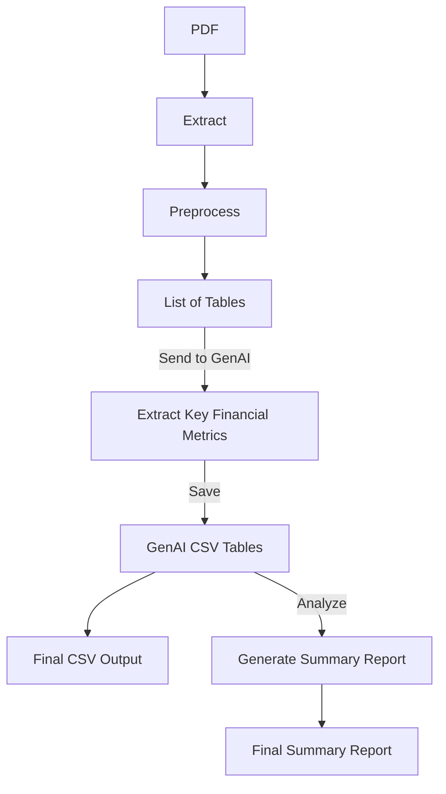

# **Financial Statement Analysis Pipeline**

## **Overview**
This project automates the extraction, processing, and analysis of financial statements using GenAI. It processes financial PDFs, extracts key financial data, and generates structured CSVs and a final summary report.

The process, justification, and future recommendations the final pipeline is documented in **Project Documentation.md** (different to README), and the raw jupyter notebook is in `exploring.ipynb`.

## **Pipeline Workflow**


## **Project Structure**
```
📁 financial_extractor/
│── 📁 data/               # Extracted CSV files are placed here
│── 📁 pdf_inputs/         # PDFs for processing
│── 📁 reports/            # Final summary reports
│── 📁 scripts/            # Contains all processing scripts
│   │── preprocess_data.py    # Extracts and cleans text from PDFs
│   │── generate_tables.py    # Processes tables via GenAI & saves CSVs
│   │── genai_summary.py      # Generates financial summaries
│   │── config.py             # Loads API keys, etc.
│── .env                  # API keys and config variables
│── main.py               # Runs the full pipeline
│── requirements.txt       # Python dependencies
│── Project_Documentation.md       # Project documentation & reasoning
│── README.md            
```

## **Setup Instructions**

### **1. Install Dependencies**
First, install the required dependencies:
```bash
pip install -r requirements.txt
```

### **2. Add Your API Key**
Create a `.env` file in the root directory and add your **Gemini API key**:
```
GEMINI_KEY=your_api_key_here
```

### **3. Run the Pipeline**
Execute the main script to process financial PDFs and generate reports:
```bash
python main.py
```

## **How It Works**

### **1. Extract Financial Data from PDFs**
- Uses `pdfplumber` to extract raw text from structured financial reports.
- Cleans and preprocesses the text to remove irrelevant headers/footers.
- Splits the text into different financial sections (e.g., **Income Statement, Balance Sheet**).

### **2. Process Tables Using GenAI**
- Each segmented financial section is sent to **Gemini AI** for structured extraction.
- AI returns structured **JSON financial data**.
- Data is formatted into CSV tables and stored in `/data`.

### **3. Generate a Summary Report**
- Reads all extracted CSVs and processes key **financial trends**.
- Uses **GenAI** to generate a **Markdown financial summary**.
- Converts the summary to a **PDF report**.

## **Outputs**
✅ **Extracted Financial Tables** → `/data/`
✅ **Summary Report (PDF)** → `/reports/summary_report.pdf`
